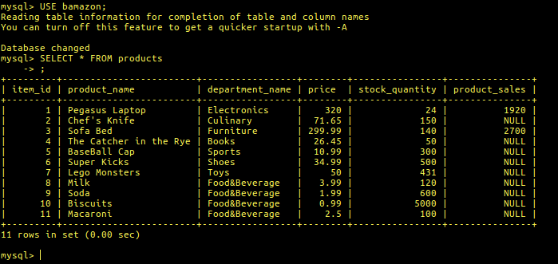

# Bamazon

Bamazon is a node CLI app that simulates a storefront managing application.

		

		Currently there is a Customer View @ bamazonCustomer.js
		and a Manager View @ bamazonManager.js
		
**Customer View:**

Format: 
**Manager View:**

Format: 
Products For Sale:

Format: 
Low Inventory:

Format: 
Update Inventory

Format: 

SQL Snippet:
	

Commands to run application:

---**Node bamazonCustomer.js**---

---**Node bamazonManager.js**---

*comming soon bamazonSupervisor.js*
		

